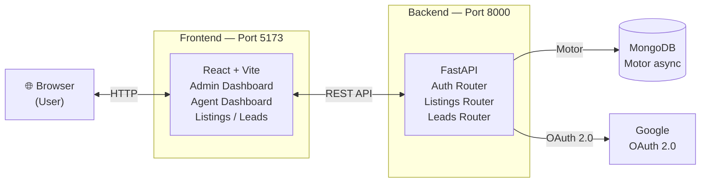
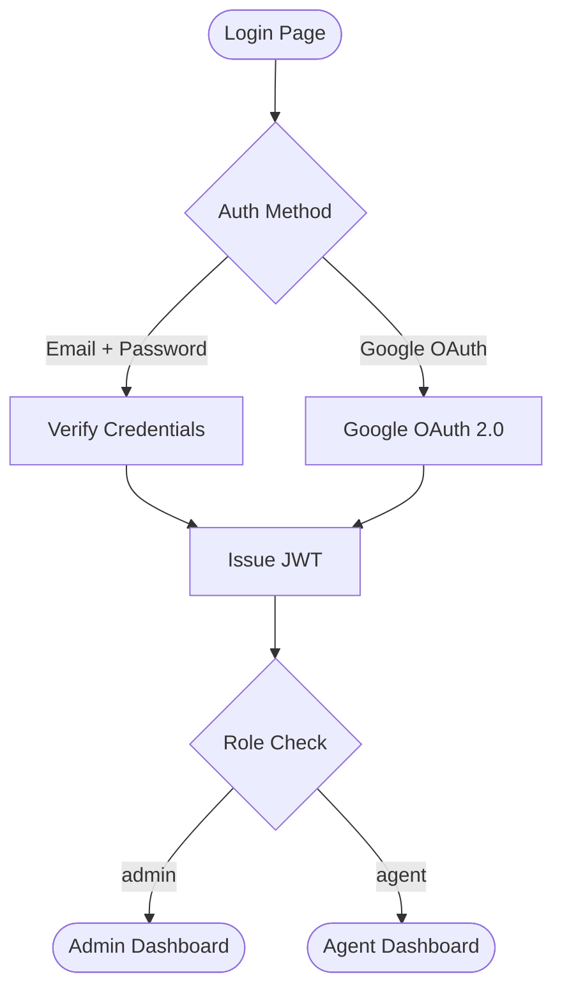
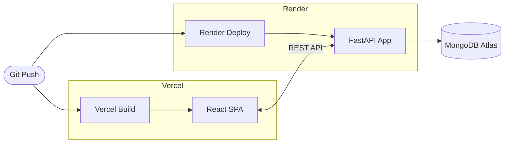

# PropDesk

> A full-stack Real Estate CRM platform for managing property listings, leads, and team operations — with dedicated dashboards for Admins and Agents.


---

## Features

| Feature | Description |
|---|---|
| **Role-based access** | Separate interfaces and permissions for `Admin` and `Agent` roles |
| **Property listings** | Add, search, and filter residential or commercial listings with image uploads |
| **Lead tracking** | Status pipeline — New → In Progress → Converted / Lost — with follow-ups |
| **Authentication** | Secure local email/password login and Google OAuth integration |
| **Multi-tenant** | Agents join specific companies and teams via secure join codes |

---

## Tech Stack

**Frontend**
- [React](https://reactjs.org/) + [Vite](https://vitejs.dev/) — lightning-fast UI development
- [Axios](https://axios-http.com/) — API requests and interceptors
- `react-router-dom` — client-side routing

**Backend**
- [FastAPI](https://fastapi.tiangolo.com/) — high-performance Python web framework
- [MongoDB](https://www.mongodb.com/) (Motor) — async document storage
- Pydantic — strict request/response validation

---

## Architecture



---

## Auth Flow



---

## Project Structure

```
📦 PropDesk
 ┣ 📂 backend/
 │  ┣ 📂 routers/          # Auth, listings, leads endpoints
 │  ┣ 📂 uploads/          # Local dev image storage
 │  ┣ 📜 main.py           # FastAPI entry point & CORS config
 │  ┣ 📜 models.py         # MongoDB models (User, Listing, Lead, Company)
 │  └ 📜 schemas.py        # Pydantic validation schemas
 └ 📂 frontend/
    ┣ 📂 src/
    │  ┣ 📂 api/            # Axios config and interceptors
    │  ┣ 📂 pages/          # Role-based dashboard pages
    │  └ 📂 utils/          # Helper and formatting functions
    ┣ 📜 index.html
    └ 📜 vite.config.js
```

---

## Local Setup

### Prerequisites

- Python 3.9+
- Node.js 18+
- MongoDB (local instance or [Atlas](https://www.mongodb.com/atlas) URI)

### 1. Database

Start a local MongoDB instance or obtain a connection URI from MongoDB Atlas.

### 2. Backend

```bash
cd backend

# Create and activate virtual environment
python -m venv venv
source venv/bin/activate        # Windows: venv\Scripts\activate

# Install dependencies
pip install -r requirements.txt

# Configure environment
cp .env.example .env
# → Set MONGO_URI, JWT_SECRET, GOOGLE_CLIENT_ID in .env

# Start the server
uvicorn main:app --reload
# Runs at http://localhost:8000
```

> The backend automatically seeds placeholder demo data on startup.

### 3. Frontend

```bash
cd frontend

# Install dependencies
npm install

# Configure environment
cp .env.example .env
# → Set VITE_API_URL=http://localhost:8000/api

# Start the dev server
npm run dev
# Runs at http://localhost:5173
```

---

## Deployment



### Frontend — Vercel

- Set `VITE_API_URL` to your production backend URL (e.g. `https://propdesk.onrender.com/api`) in the Vercel dashboard
- Environment variables are baked at build-time — **redeploy after any changes**

### Backend — Render

- Deploy as a **Web Service**
- Set `ALLOWED_ORIGINS` to your exact Vercel URL to prevent CORS errors
- Provide `MONGO_URI` from MongoDB Atlas

> **⚠️ Storage Warning:** Render's free tier uses ephemeral storage. Images saved to the local `uploads/` directory will be lost on server restart. For production, integrate cloud object storage — [Cloudinary](https://cloudinary.com/) or [AWS S3](https://aws.amazon.com/s3/).

---

## Environment Variables

| Variable | Location | Description |
|---|---|---|
| `MONGO_URI` | Backend | MongoDB connection string |
| `JWT_SECRET` | Backend | Secret key for signing JWTs |
| `GOOGLE_CLIENT_ID` | Backend | Google OAuth 2.0 client ID |
| `ALLOWED_ORIGINS` | Backend (prod) | Comma-separated allowed CORS origins |
| `VITE_API_URL` | Frontend | Base URL of the backend API |

---

## License

MIT